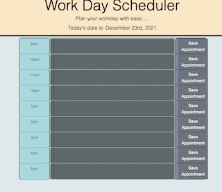

# Work-Day-Scheduler

---
### __Table of Contents__

- [Description](#description)
- [Technologies](#technologies)
- [References](#references)
- [Author Info](#author-info)

---

### __Description__

> This application was designed to assist the user's time management during a standard 8-hour workday, by allowing the user to see the current date for reference and 8 timeblocks for the full workday.  The user can enter appointments or events into the text area, and the input will be stored in local storage.  

---

---

#### __Technologies__

- HTML
- CSS
- Javascript
- jQuery
- Bootstrap
- Moment.js
- Ajax

---

#### __References__

[jQuery](https://ajax.googleapis.com/ajax/libs/jquery/3.6.0/jquery.min.js)

[moment.js](https://momentjs.com/)

[bootstrap](https://getbootstrap.com/)

[W3Schools](https://www.w3schools.com/)

[MDN](https://developer.mozilla.org/en-US/)

---

#### __Author Info__

[Heather Cooper](https://github.com/cheribc)
